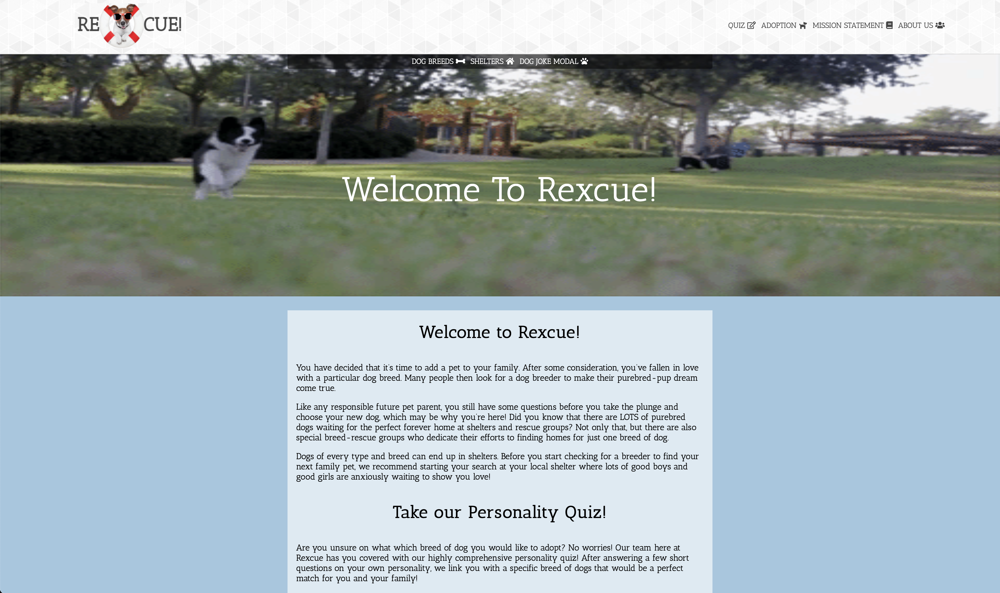
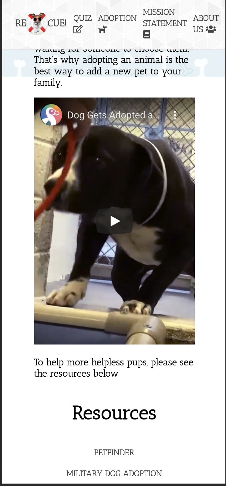
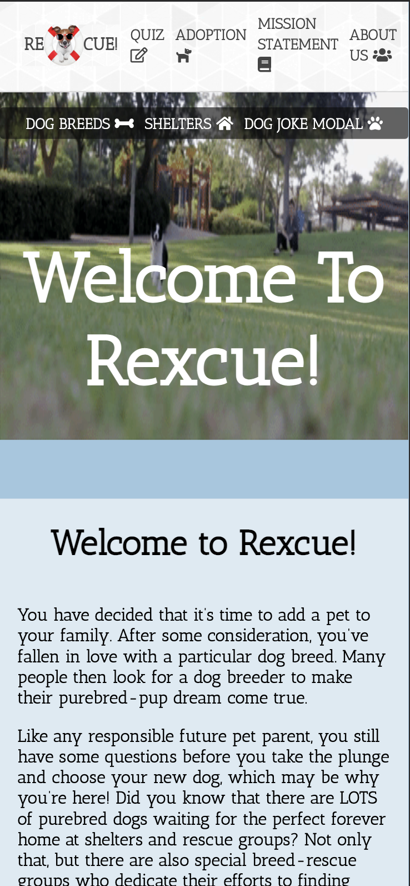

# Week 6 of Coding Bootcamp

Week 6 was project week and it has been something I've been looking forward to since the start of class. The project was based on Front End development, where we mainly stayed within the boundaries of HTML, CSS and JavaScript. I was in a group of 3, and we decided to create a website that was centered around informing/encouraging people to adopt dogs from shelters instead of going through breeders.

## The Process

Overall I was really pleased with how our group handled the process, but thats not to say that there weren't any challenges. We did an awesome job of laying out our plans and deciding which features we wanted to include on each page of the site. After everything was established, we divided up the work and started grinding out the code. My main part of the project was coming up with the design and styling. I really enjoyed this process and I am truly happy with how everything turned out. Through this, I feel that I have become really comfortable with CSS and getting content to line up exactly how I want it on the HTML. This practice did consume most of every day of the week, and not a lot of sleep was had! It started as a struggle, but ended with me making decisions like it was muscle memory. So much that I didn't want to stop coding! After most of the page layouts were complete, I began helping my team members with the JavaScript portion of the project. This is where things went south... 

Dealing with the API's we really wanted to use really tested my patience and made me step away from my desk more times than I can remember. The API's we used required you to sign up, request keys that didn't show up until a day before presentation day, CORS BLOCKERS EVERYWHERE, and just limited initial knowledge that made things difficult. Ultimately we were able to get our main objectives completed in time, and I feel that the presentation went great.

## What I would Have Done Differently

After reflecting on this project, here is a list of things I would have liked to have done differently:

    1) Don't bite off more than you can chew!
        Our group had LOTS of great ideas for the site that we really wanted to try and make work. But this resulted in us working all day every day, even the weekend and up to the very last second of presentation day. The amount of stress that came with it was just worth it!
    
    2) Do a better job of limiting yourself on working on specific code that you are stuck on.
        I found myself spending waayyyyyy too much time trying to solve a single problem and barely asked my teammates or instructors for help. Again, too much stress.

    3) Get more sleep!
        Being the stubborn perfectionist I am, I would stay up very late every night trying to perfect my code. I could feel that throughout the week I was not able to think as clearly as the day before, and it would just be frustrating!

## Screenshots

Like I mentioned before, Im overall really happy with how this turned out!

![](images/quizMobile.png